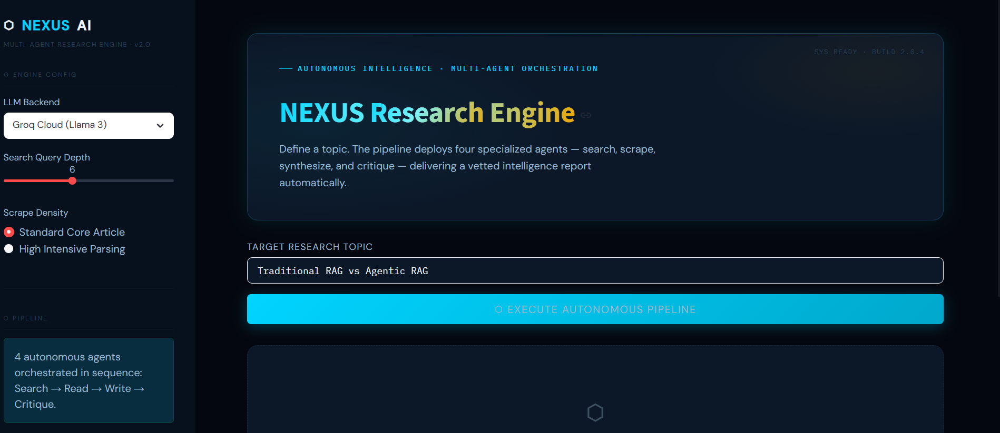
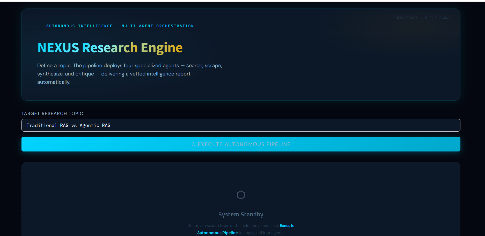
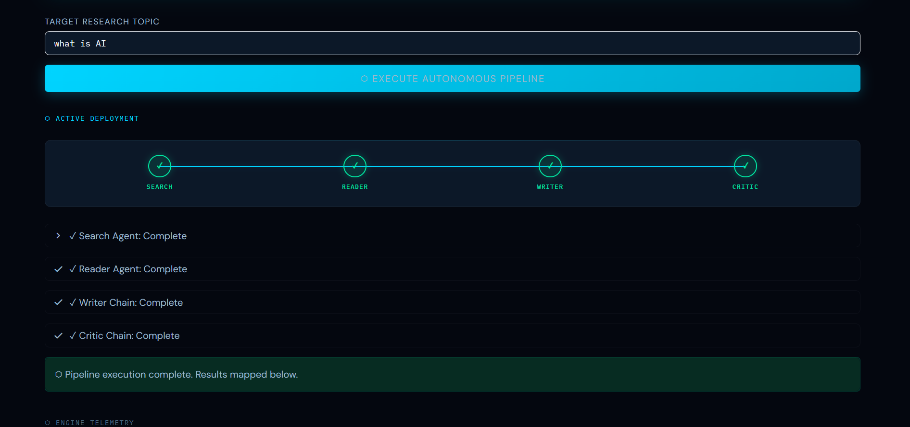
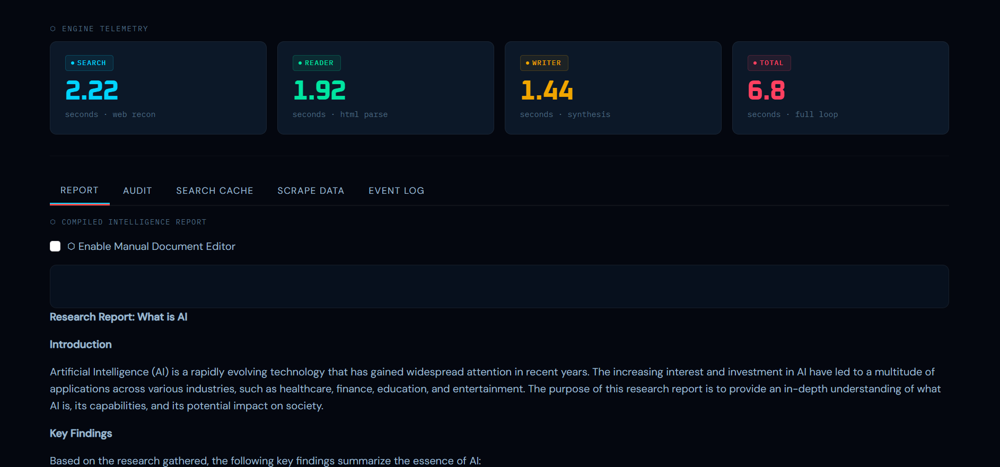

# 🚀 Multi-Agent Autonomous Research Engine

An advanced **LLM-powered Multi-Agent AI platform** that automates intelligent research, reasoning, and report generation using autonomous AI agents.

The system enables multiple specialized AI agents to collaborate together for task planning, information retrieval, analysis, and structured response generation.

---

## ✨ Features

- 🤖 Multi-Agent AI Architecture  
- 🧠 Autonomous Task Planning & Execution  
- 🔍 LLM-Based Research Generation  
- 🤝 Intelligent Agent Collaboration  
- ⚡ Real-Time Workflow Processing  
- 🎨 Modern Interactive UI  
- 📄 Research Summarization  
- 🏗️ Modular & Scalable Design  
- 🔌 API Integration Ready  
- 🚀 Fast & Lightweight System  

---

## 🛠️ Tech Stack

### Frontend
- Streamlit
- HTML/CSS
- Python UI Components

### Backend
- Python
- Multi-Agent Workflow Engine

### AI & LLM
- OpenAI GPT Models
- LangChain
- Autonomous AI Agents

---

## 🔄 Project Workflow

```text
User Input
    ↓
Planner Agent
    ↓
Research Agents
    ↓
Analysis Agent
    ↓
Report Generation Agent
    ↓
Final Structured Output
```

### Workflow Explanation

1. User enters a research topic  
2. Planner Agent analyzes the task  
3. Research Agents collect and process information  
4. Analysis Agent evaluates findings  
5. Report Agent generates final response  
6. UI displays structured research output  

---

## 📸 Screenshots

### 📌 Dashboard Preview


### 🏠 Home Interface


---

### 🔄 Multi-Agent Workflow


---

### 📊 Generated Research Output


---

## ⚙️ Installation

Clone the repository:

```bash
git clone https://github.com/amarbhardwaj112003/multi-agent-research-assistant.git
```

Move into the project directory:

```bash
cd multi-agent-research-assistant
```

Create virtual environment:

```bash
python -m venv venv
```

Activate virtual environment:

### Windows
```bash
venv\Scripts\activate
```

### Linux / Mac
```bash
source venv/bin/activate
```

Install dependencies:

```bash
pip install -r requirements.txt
```

---

## ▶️ Run the Project

```bash
streamlit run app.py
```

---

## 📁 Project Structure

```text
Multi-Agent-AI/
│── screenshots/
│── app.py
│── agents.py
│── pipeline.py
│── tools.py
│── requirements.txt
│── README.md
```

---

## 🔮 Future Enhancements

- 🌐 Web Search Integration
- 🧠 Memory-Based Agents
- 🗂️ Vector Database Support
- 🔗 Agent Communication Graph
- 🎙️ Voice-Based AI Assistant
- 📄 PDF & Report Export
- ☁️ Cloud Deployment

---

## 👨‍💻 Author

**Amar Kumar Singh**  
Final Year B.Tech CSE Student  
AI/ML & Full Stack Developer

---

## 📜 License

## © Amar Kumar Singh

All rights reserved.
